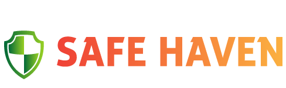
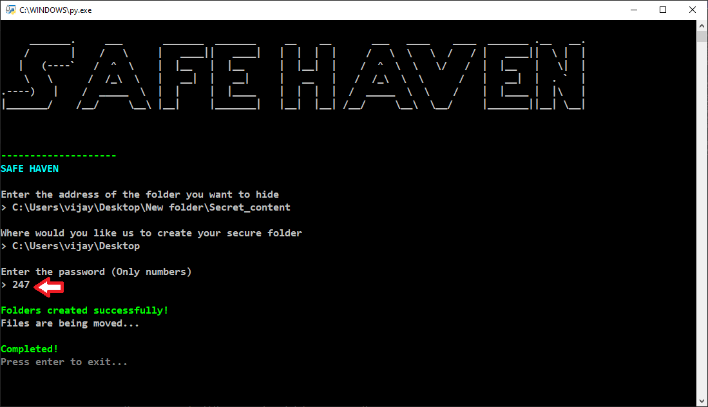
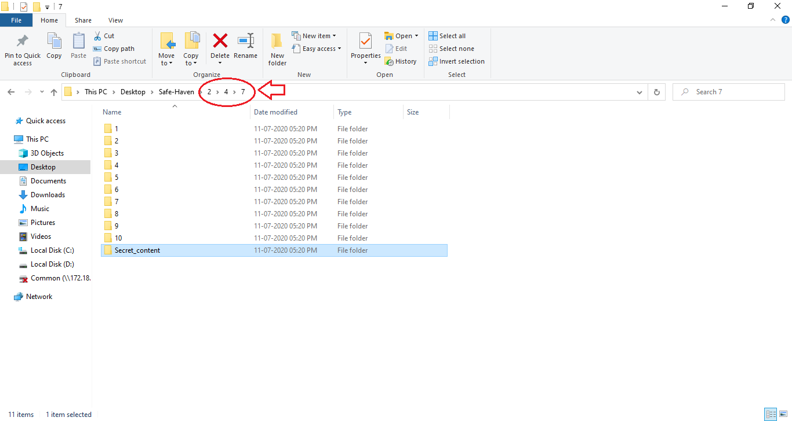
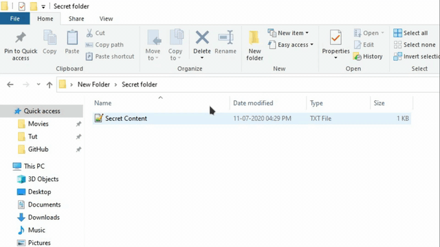

# Safe-Haven

    
     Hide your secret files and folders with ease.

---

## Table of Contents

- [Motivation](#Motivation)
- [Installation](#Installation)
- [Usage](#Usage)
- [Demo](#Demo)
- [Disclaimer](#Disclaimer)
- [Contributing](#Contributing)
- [License](#License)

## Motivation

Invasion of privacy is a serious issue. The main reason I built this application was to help people hide their secret files and folders from prying eyes.
With this application, you can rest knowing that your files are safely hidden away.

**Note** : Safe-Haven only hides your files. It does not secure them.

## Usage

For the latest stable version, head to [Releases](https://github.com/SVijayB/Safe-Haven/releases).

Download and extract the source code.

As an alternative, you could also clone the repository using,

<pre>
git clone https://github.com/SVijayB/Safe-Haven.git
</pre>

Firstly, Create a folder with all the files you want to hide. Once done,

Run the `Safe-Haven.py` file present in the `src` folder.

You can do that by just double clicking on the file if you have the *python launcher* installed. Else, **`cd/`** to the **`src`** folder and type `python Safe-Haven.py`.

Now, copy the address of the folder you created earlier and paste it in the application.

Next, the application asks where you want to create your secure folder. Give it the address of the folder you want to save it to. Eg: `C:\Users\Username\Desktop`.

Now, when it asks for a password, provide a password that is atleast 3 characters in length. 
**Note** : Password has to be an integer.

Now, A folder with the name Safe-Haven will be created at the location provided. To access the files/folders that you hid. Open Safe-Haven and navigate folders from 1-10 based on the password entered.
Eg : If you password was 157, Open the Safe-Haven folder and open folder 1 and then 5 and then 7. You can find your folder with all the files here.

    

    

## Demo

    

## Disclaimer

The use of the Safe-Haven and its resources is **COMPLETE RESPONSIBILITY** of the **END-USER**. 
This application only hides your files/folders. It does not ensure the security of them. The developers of this application are not responsible for loss or theft of data.

## Contributing 

To contribute to Safe-Haven, fork the repository, create a new branch and send us a pull request. Make sure you read [CONTRIBUTING.md](https://github.com/SVijayB/Safe-Haven/blob/master/.github/CONTRIBUTING.md) before sending us Pull requests. 

Also, thanks for contributing to Open-source!

## License 

Safe-Haven is under The MIT License. Read the [LICENSE](https://github.com/SVijayB/Safe-Haven/blob/master/LICENSE) file for more information.
